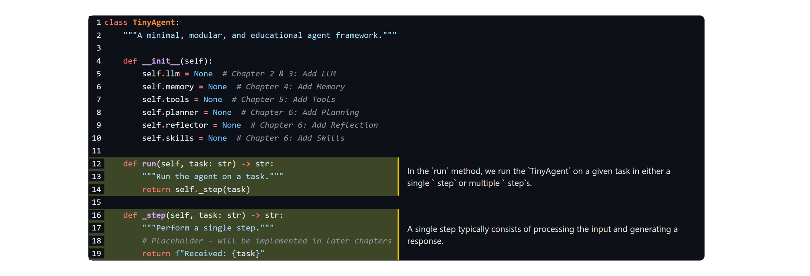
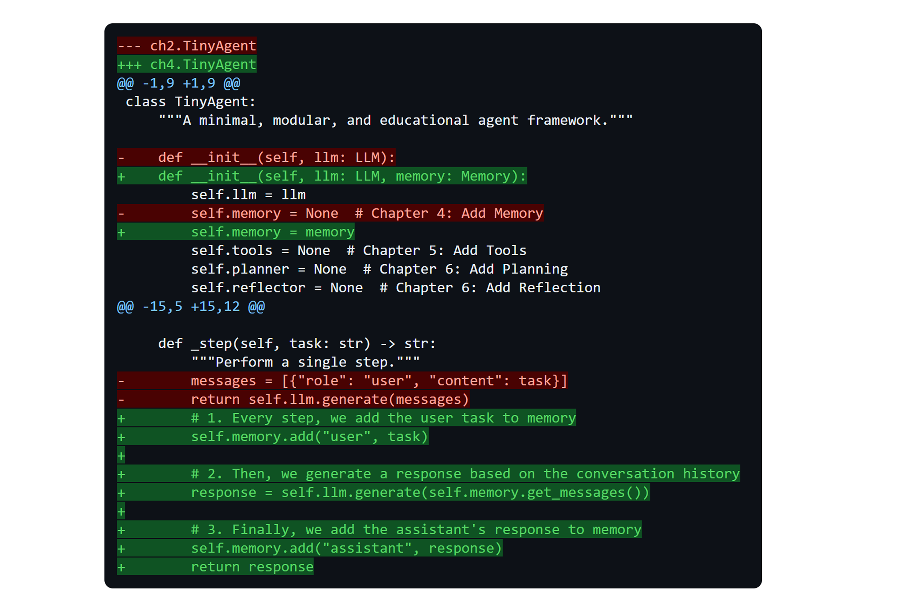

# An Illustrated Guide to AI Agents

<a href="https://www.linkedin.com/in/mgrootendorst/"></a>
<a href="https://www.linkedin.com/in/jalammar/"></a>
[](https://pypi.org/project/illustrated-agents/)

Welcome! Here, you will find the code for the book [An Illustrated Guide to AI Agents](https://www.amazon.com/Illustrated-Guide-AI-Agents-Concepts/dp/B0GTYL2QSJ) written by [Maarten Grootendorst](https://www.linkedin.com/in/mgrootendorst/) and [Jay Alammar](https://www.linkedin.com/in/jalammar/). In this repository, you will:<br> 

<p align="center"><b><i>"Build an Agent From Scratch!"</i></b></p> 

Through the visually educational nature of this book and with **more than 300 custom made figures**, learn the practical tools and concepts you need to use AI Agents today!


<br>


## Table of Contents - Build a `TinyAgent` from Scratch!

The code examples in this repo are used for you to start building a `TinyAgent` entirely from scratch, using nothing more than LLM calls. You will learn how to create your own Agent that has memory, tools, and autonomy! 

All examples can be run in Google Colab for **free** using their T4 GPU. You have options for running everything either locally or on the cloud without any additional costs involved.


| Chapter  | Notebook  |
|---|---|
| Chapter 1: Introduction to AI Agents  | [](https://colab.research.google.com/github/HandsOnLLM/An-Illustrated-Guide-To-AI-Agents/blob/main/chapter01/chapter01.ipynb)   |
| Chapter 2: Large Language Models  | [](https://colab.research.google.com/github/HandsOnLLM/An-Illustrated-Guide-To-AI-Agents/blob/main/chapter02/chapter02.ipynb)  |
| Chapter 3: Reasoning Large Language Models  |  [](https://colab.research.google.com/github/HandsOnLLM/An-Illustrated-Guide-To-AI-Agents/blob/main/chapter03/chapter03.ipynb)  |
| Chapter 4: Memory  | [](https://colab.research.google.com/github/HandsOnLLM/An-Illustrated-Guide-To-AI-Agents/blob/main/chapter04/chapter04.ipynb)  |
| Chapter 5: Tools  | [](https://colab.research.google.com/github/HandsOnLLM/An-Illustrated-Guide-To-AI-Agents/blob/main/chapter05/chapter05.ipynb)  |
| Chapter 6: Planning  | [](https://colab.research.google.com/github/HandsOnLLM/An-Illustrated-Guide-To-AI-Agents/blob/main/chapter06/chapter06.ipynb)  |
| Chapter 7: Evaluation | [](https://colab.research.google.com/github/HandsOnLLM/An-Illustrated-Guide-To-AI-Agents/blob/main/chapter07/chapter07.ipynb)  |
| Chapter 8: Multi-Agent Collaboration  | [](https://colab.research.google.com/github/HandsOnLLM/An-Illustrated-Guide-To-AI-Agents/blob/main/chapter08/chapter08.ipynb)  |
| Chapter 9: Multimodal Understanding  | [](https://colab.research.google.com/github/HandsOnLLM/An-Illustrated-Guide-To-AI-Agents/blob/main/chapter09/chapter09.ipynb)  |
| Chapter 10: Coding Agents  |  [](https://colab.research.google.com/github/HandsOnLLM/An-Illustrated-Guide-To-AI-Agents/blob/main/chapter10/chapter10.ipynb)  |

> [!TIP]
> You can check the [setup](.setup/) folder for a quick-start guide to install all packages locally.


## Reviews

> "*The authors are exceptional builders, and this book is a testament to the depth of their knowledge. The generous illustrations and hands-on TinyAgent exercise make the concepts approachable, intuitive, and fun to learn.*"
>    
> **Chip Huyen** - author of [AI Engineering](https://www.oreilly.com/library/view/ai-engineering/9781098166298/) and [Designing Machine Learning Systems](https://www.oreilly.com/library/view/designing-machine-learning/9781098107956/)

---

> "*I have thought a lot about how to teach AI systems, and this book still surprised me with how much of the domain of modern AI agents it could make clear through illustrations. Maarten and Jay do an impressive job identifying and explaining the timeless ideas in this fast-moving field, and I expect this to become the first book I recommend to anyone who wants to understand how modern agents work and how to build them.*"
>
> **Omar Khattab** - assistant professor, MIT EECS.

---

> "*Grootendorst and Alammar explain the entire AI agent stack, from tokenization to multiagent systems, in an engaging visual style. As the field evolves, this book will continue to serve as a useful reference because it covers the subject matter so thoroughly.*"
>
> **Ofir Press** - research scientist at Meta FAIR, coauthor of SWE-bench and SWE-agent.

---

## A Unique Way of Learning

We wanted to do something special this time around and allow readers to **Build an Agent From Scratch**! However, we did not stop there and wanted the act of building the Agent to be a modular experience that enhances the learning experience. By iteratively adding components, one at a time, it becomes much more intuitive how an Agent actually works.


We decided to combine this with creative (if we say so ourselves) ways to explain what is happening and how each added component affects your `TinyAgent`!


Through a philosophy centered around modularity, each chapter can neatly cover a single topic. As such, that allows us to do things like annotate code to help you understand what reason is for specific lines of code.



As we are building up your `TinyAgent` there might be many code changes happening in certain chapters. To illustrate the effect of these changes on your `TinyAgent`, we made use of diffs as a way to ease the learning curve.




## Citation

Please consider citing the book if you consider it useful for your research:

```
@book{illustrated-agents-book,
  author       = {Maarten Grootendorst and Jay Alammar},
  title        = {An Illustrated Guide to AI Agents},
  publisher    = {O'Reilly},
  year         = {2026},
  isbn         = {979-8341662698},
  url          = {https://www.oreilly.com/library/view/an-illustrated-guide/9798341662681/},
  github       = {https://github.com/HandsOnLLM/An-Illustrated-Guide-To-AI-Agents}
}
```
