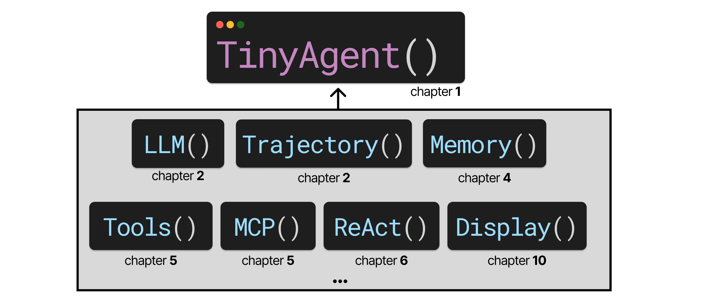

# `TinyAgent`

The source code for "An Illustrated Guide to AI Agents" where you build an `TinyAgent` from scratch by building it up with one module at a time:



The general idea is that each module is self-contained and added to the `TinyAgent` with minimal changes when progressing through the book. At the end, you will have learned about each module in detail and can **Build an Agent from Scratch** like so:


```python
# Modules to augment your Agent
from illustrated_agents.llm import LLM  # llm.py
from illustrated_agents.memory import Memory  # memory.py
from illustrated_agents.tools import Tools, Skills  # tools.py
from illustrated_agents.planning import NativeReAct  # planning.py
from illustrated_agents.toolbox import get_weather  # toolbox.py

# The TinyAgent
from illustrated_agents.agent import TinyAgent  # tinyagent.py

# Choose an LLM - Using Ollama through an OpenAI endpoint
llm = LLM(model="my_model", api_base="http://localhost:11434/v1/")

# Add Memory (simple conversation memory)
memory = Memory()

# Create autonomous behavior through explicit THOUGHT/ACTION/OBSERVATION cycles
react = ReAct(max_steps=10)

# Add Tools through explicit tool calling 
tools = Skills()
tools.add_tool("my_tool", my_tool)

# Add Skill
tools.add_skill(path_to_my_skill.md)

# Create agent
agent = TinyAgent(
    llm=llm, 
    tools=tools, 
    memory=memory, 
    planner=react, 
    skills=skills
)
```

Each module is separated from the `TinyAgent` so that it can be learned as a modular component step-by-step.
